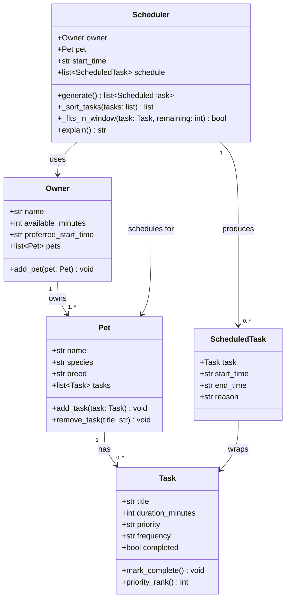

```mermaid
classDiagram
    class Owner {
        +str name
        +int available_minutes
        +str preferred_start_time
        +list~Pet~ pets
        +add_pet(pet: Pet) void
    }

    class Pet {
        +str name
        +str species
        +str breed
        +list~Task~ tasks
        +add_task(task: Task) void
        +remove_task(title: str) void
    }

    class Task {
        +str title
        +int duration_minutes
        +str priority
        +str frequency
        +bool completed
        +mark_complete() void
        +priority_rank() int
    }

    class ScheduledTask {
        +Task task
        +str start_time
        +str end_time
        +str reason
    }

    class Scheduler {
        +Owner owner
        +Pet pet
        +str start_time
        +list~ScheduledTask~ schedule
        +generate() list~ScheduledTask~
        +_sort_tasks(tasks: list) list
        +_fits_in_window(task: Task, remaining: int) bool
        +explain() str
    }

    Owner "1" --> "1..*" Pet : owns
    Pet "1" --> "0..*" Task : has
    Scheduler --> Owner : uses
    Scheduler --> Pet : schedules for
    Scheduler "1" --> "0..*" ScheduledTask : produces
    ScheduledTask --> Task : wraps
```
